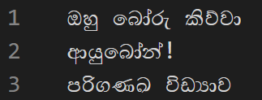
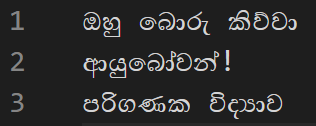
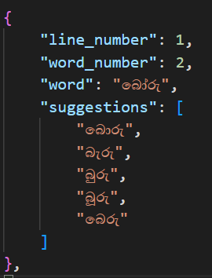

# sinhala-spell-checker
A spell checker for the Sinhala language built with Python

# Features
- Automatically fix spelling errors
- Provide word suggestions to fix spelling errors

# How it works
This script constructs a **trie** from the words listed in `data/dict.txt` and uses the **Levenshtein distance algorithm** to generate the most accurate suggestions for any misspelled word it detects.
Priority for letter modifications is given in the following order:
1. Adding/Removing/Modifying vowel marks (පිල්ලම්)
2. Changing Case of letter (මහාප්‍රාණ, මූර්ධජ)
3. Adding/Removing/Modifying letters

# Input
Input should be given as a text file with `UTF-16` encoding
<br>


# Output
This program will provide a text file with the automatically corrected output and a JSON file with the word suggestions for each misspelled word
<br>

<br>


# Usage
1. Clone the repository
```bash
git clone https://github.com/MalithaBandara/sinhala-spell-checker.git
```
2. Navigate to the project directory
```bash
cd sinhala-spell-checker
```
3. Add the input text to `assets/input.txt`
4. Run main.py
```bash
python main.py
```
5. Find the corrected output at `assets/output.txt` and word suggestions at `assets/output.json`
